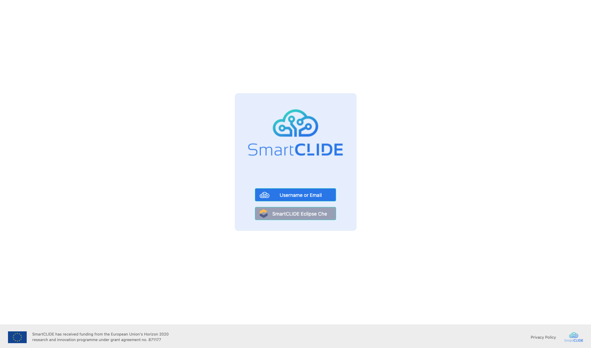
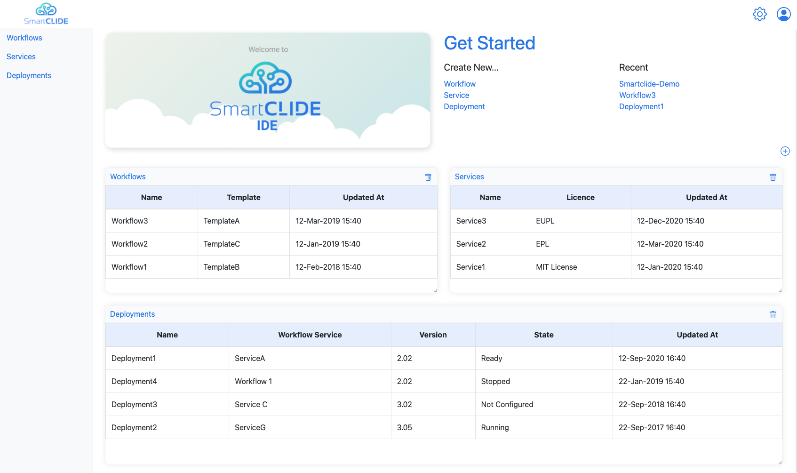
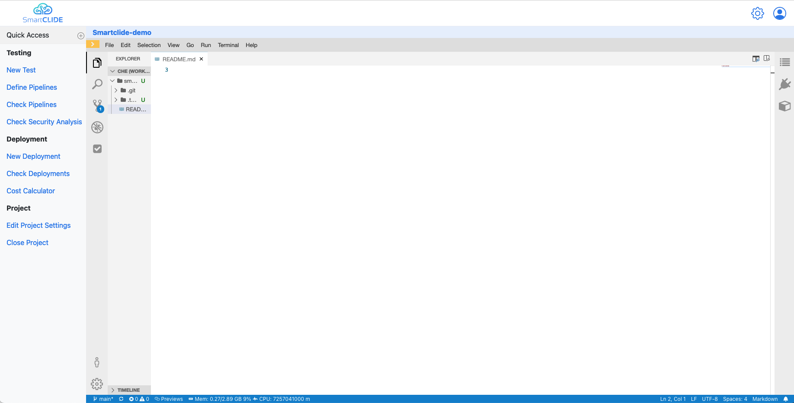

# SmartCLIDE IDE

This is the base project of the SmartCLIDE IDE User Interface where all the SmartCLIDE components will be integrated
and their functionalities made available to the users.

The current version provides:

- Basic website structure
- User authentication with previously created Eclipse Che accounts
- Dashboard with some widget's examples
- Opening and closing existing workspaces
- Code development using an instance of Eclipse Che Theia (if the IDE and Keycloak are deployed in the same domain)

The upcoming features will include:

- Full user management functionalities
- Dashboard with interactive and dynamic widgets
- Complete workspace management tools
- Support for complete development flows

## Running the project from code

### Install Meteor on your computer

https://www.meteor.com/developers/install

#### OSX / Linux
```shell
curl https://install.meteor.com/ | sh
```

#### Windows
```shell
npm install -g meteor
```

### Clone the project from GitLab 

```shell
git clone https://github.com/eclipse-opensmartclide/smartclide-ide-front-end.git
```

### Install dependencies and run the project

```shell
cd ide
meteor npm install
meteor --port 8080
```

Access the IDE at http://localhost:8080

## Running the official Docker image

### Clone the project repository

```shell
git clone https://github.com/eclipse-opensmartclide/smartclide-ide-front-end.git
```

### From the root, run the docker-compose file

```shell
docker-compose up
```

Access the IDE at http://localhost:8080

## Accessing the online version

Navigate to https://ide.che.smartclide.eu.

## Main Pages

### Login

Users can log in by providing:

1) SmartCLIDE credentials (i.e., username/email and password) - is intended for development uses only.
2) SmartCLIDE Eclipse Che credentials - all users are expected to use this option.

Keep in mind that signing up will only become available in future versions. At the current time users need to request an account for [SmartCLIDE Che Dashboard](http://che-smartclide-che.che.smartclide.eu/) to use the IDE.



### Dashboard

After logging in, the user is redirected to the dashboard where they can see an overview of their work through a set
of movable widgets.



### Project View

By clicking a project in the "Recent" section, the project view is presented. There, the code of the previously
configured workspace can be edited.

Since project creation is not supported yet, new workflows must be created using
[SmartCLIDE's Che Dashboard](https://che-smartclide-che.che.smartclide.eu/dashboard/#/workspaces) before being accessed in the IDE.



## License
[Eclipse Public License 2.0](https://choosealicense.com/licenses/epl-2.0/)
